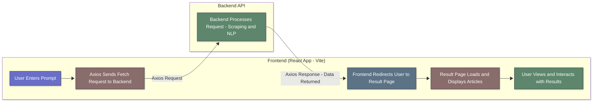

# 📰 Infonova Front-End

A modern React-based front-end application for our Finals Examination/Project, built with Vite. This application serves as a news scraper and search interface, allowing users to search and view articles from various trusted news sources.

## 🔍 Overview

The Infonova System is an NLP (Natural Language Processing) project that scrapes or fetch news from multiple Philippine and international news sources. The frontend provides a user-friendly interface for searching articles and viewing results in an organized layout.

## ✨ Features

- **News Search**: Search functionality for articles across supported news websites
- **Responsive Design**: Mobile-friendly interface 
- **Modern UI**: Built with Tailwind CSS for clean and modern styling
- **Fast Development**: Powered by Vite for rapid development and hot module replacement
- **Routing**: Client-side routing with React Router DOM
- **API Integration**: Axios for backend communication

## 🌐 Supported News Sources

- GMA News
- CNN Philippines
- Philippine Daily Inquirer
- Manila Bulletin
- Rappler

## ⚙️ Tech Stack

### ⚙️ Core Technologies
- **React 19**: Latest React with modern hooks and features
- **Vite**: Fast build tool and development server
- **React Router DOM**: Client-side routing

### ❇️ Styling & UI
- **Tailwind CSS**: Utility-first CSS framework
- **PostCSS**: CSS processing with autoprefixer
- **Styled Components**: Additional styling capabilities

### ⚙️ Development Tools
- **ESLint**: Code linting with React-specific rules
- **Lucide React**: Modern icon library

### Dependencies
- **Axios**: HTTP client for API requests

## 📂 Project Structure

```
frontend/
├── public/                # Static assets
│   └── nstrenLOGO.jpg     # Application logo
├── src/
│   ├── assets/            # Images and media files
│   │   ├── images/        # News source logos and backgrounds
│   │   └── react.svg
│   ├── components/        # Reusable UI components
│   │   ├── LoadingScreen/ # Loading components
│   │   └── Navigation/    # Navigation components
│   ├── Layouts/           # Page layouts
│   │   ├── Default.jsx    # Main layout wrapper
│   │   ├── Header.jsx     # Header component
│   │   └── Footer.jsx     # Footer component
│   ├── pages/             # Page components
│   │   ├── home/          # Home page
│   │   ├── search/        # Search page
│   │   └── result/        # Results page
│   ├── App.jsx            # Main app component with routing
│   ├── main.jsx           # Application entry point
│   ├── index.css          # Global styles
│   └── App.css            # App-specific styles
├── build.sh               # Build and deployment script
├── package.json           # Dependencies and scripts
├── vite.config.js         # Vite configuration
├── tailwind.config.js     # Tailwind CSS configuration
├── postcss.config.js      # PostCSS configuration
├── eslint.config.js       # ESLint configuration
└── README.md              # Contains the Documentation of the Project
```

## ⁉️ How It Works

### 🔁 Application Flow
1. **Home Page**: Landing page with basic information
2. **Search Page**: User enters search query and submits
3. **Results Page**: Displays aggregated articles from news sources

### 📊 Diagram 



### 🔑 API Integration
The frontend communicates with a backend API (located in `../backend/`) to fetch search results. The backend handles web scraping and NLP processing of news articles.

## ℹ️ Installation & Setup

### Prerequisites
- Node.js (version 18 or higher)
- npm or yarn package manager

### Installation
1. Navigate to the frontend directory:
   ```bash
   cd frontend
   ```

2. Install dependencies:
   ```bash
   npm install
   ```

### Development
Start the development server:
```bash
npm run dev
```
The application will be available at `http://localhost:5173`.

## Configuration

### Vite Configuration
Located in `vite.config.js`:
- React plugin for JSX support
- Base path set to empty string for proper routing

### Tailwind CSS Configuration
Located in `tailwind.config.js`:
- Content paths for purging unused CSS
- Custom font family (Inter)

### ESLint Configuration
Located in `eslint.config.js`:
- React and JSX rules
- Browser globals
- React hooks and refresh plugins

## 🛫 Development Guidelines

### 🧑🏻‍💻 Code Style
- Use ESLint rules for consistent code formatting
- Follow React best practices
- Use Tailwind utility classes for styling

### 🔑 API Integration
Use Axios for API calls. Example:
```javascript
import axios from 'axios';

const fetchArticles = async (query) => {
  const response = await axios.get(`/api/search?q=${query}`);
  return response.data;
};
```

## 🐞 For Troubleshooting

### ⚠️ Common Issues
- **Port conflicts**: Change Vite's default port in `vite.config.js`
- **Build failures**: Ensure all dependencies are installed
- **Styling issues**: Check Tailwind configuration and content paths

### 🌐 Development Server
If the dev server doesn't start:
1. Clear node_modules: `rm -rf node_modules && npm install`
2. Check Node.js version: `node --version`

## Contributing

1. Follow the established code style
2. Test changes in development mode
3. Ensure responsive design works on mobile devices
4. Update this README if adding new features
